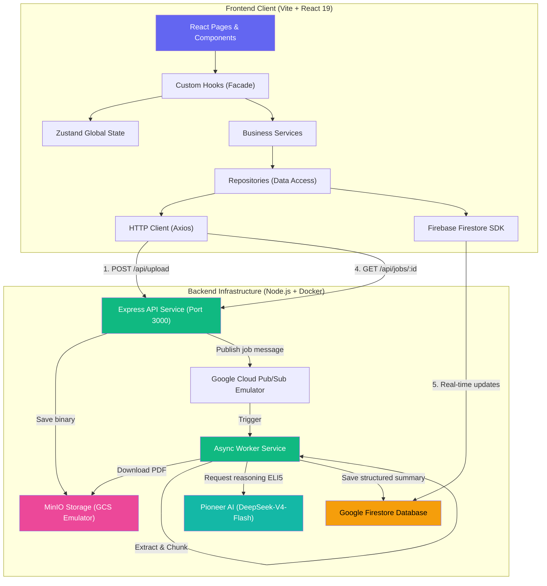

# ChainExplain — Cryptocurrency Whitepaper ELI5 Explainer

ChainExplain is a modern full-stack web application designed to demystify complex technical concepts and jargon found within cryptocurrency whitepapers and Web3 protocols. Leveraging the power of Pioneer AI (DeepSeek-V4-Flash) and an asynchronous event-driven architecture, ChainExplain distills complex documents into simple, beginner-friendly, and bilingual (Indonesian & English) ELI5 (Explain Like I'm 5) summaries.

---

## 🎯 Key Features

1. **PDF Document Upload**: Instantly upload whitepaper files (supports files up to 10MB).
2. **Real-time Processing Pipeline**: Live visualization of processing pipeline steps (Extracting ➡️ Chunking ➡️ Summarizing) backed by Firestore real-time synchronization.
3. **Bilingual ELI5 Summaries**: Get instant summaries in both Indonesian and English, rich with simple analogies tailored for complete beginners.
4. **Structured Chapter Chunks**: Document summaries are split into logical, focused chapters to facilitate modular reading and quick scanning.
5. **Premium Dark & Light Mode**: A world-class glassmorphic visual interface with fluid transitions and tactile micro-interactions powered by Framer Motion.
6. **Premium Glassmorphic Error Page & Dynamic Diagnostics**: A dedicated, highly aesthetic fallback screen that dynamically reads error parameters (React Router state or query parameters) and displays beautiful theme-aware technical system logs for enhanced troubleshooting.
7. **Robust Mock Simulation & Polling Fallback**: A self-healing frontend architecture that automatically falls back to HTTP polling or simulated mock timelines if the network or database connection goes offline during development.
8. **Distributed Idempotency Lock**: Backend worker leverages transaction-based atomic locking to guarantee zero race conditions and prevent redundant, expensive LLM calls under slow messaging networks.
9. **Full-Stack Containerization**: Production-ready and development-friendly Docker orchestration that spins up the entire ecosystem in seconds.

---

## 🏗️ System Architecture

ChainExplain is divided into two primary services: **Backend** (Express API + Async Worker Service) and **Frontend** (Vite + React 19 Client).



---

## 💻 Tech Stack

### Backend (Node.js CommonJS)
- **Server Framework**: Express 5.x
- **Storage**: MinIO SDK (Local S3 / Google Cloud Storage emulator compatibility)
- **Database**: Google Firestore Admin SDK
- **Queue/Messaging**: Google Cloud Pub/Sub Client
- **Text Extraction**: `pdf-parse` v2 (modern class-based API)
- **Idempotency**: Atomic Firestore Transaction Locks
- **AI Reasoning**: Pioneer AI API (`deepseek-ai/DeepSeek-V4-Flash` model)

### Frontend (React ES Modules)
- **Vite 8.x + React 19.x**
- **State Management**: Zustand 5.x
- **Styling**: Tailwind CSS + Shadcn UI primitive components
- **Animations**: Framer Motion 12.x (Spring physics: stiffness 100/200, damping 15/20)
- **Routing**: React Router 7.x
- **Icons**: Lucide React
- **Network Client**: Axios HTTP Client + Firebase Web Client SDK
- **Testing**: Vitest + React Testing Library + JSDom (56 unit tests)

---

## 🔌 API Contract Reference

The backend Express API exposes three main endpoints on port `3000`:

### 1. `POST /api/upload`
Uploads a whitepaper PDF file and registers a new processing job.
- **Request**: `multipart/form-data`, key `file` (PDF file, <= 10MB)
- **Success Response (201 Created)**:
```json
{
  "success": true,
  "data": {
    "jobId": "8bcf15ef-7128-4ef1-be0b-bcfef252f901",
    "status": "PENDING",
    "fileName": "bitcoin.pdf"
  }
}
```

### 2. `GET /api/jobs/:jobId`
Retrieves the current status and latest summary data for a job (used as HTTP polling fallback).
- **Success Response (200 OK)**:
```json
{
  "success": true,
  "data": {
    "id": "8bcf15ef-7128-4ef1-be0b-bcfef252f901",
    "status": "COMPLETED",
    "progress": 100,
    "project_name": "Bitcoin",
    "fileName": "bitcoin.pdf",
    "createdAt": "2026-05-26T12:00:00.000Z",
    "summaryId": {
      "project_vision": "Sistem uang elektronik peer-to-peer tanpa perantara pihak ketiga.",
      "overall_summary": "Bitcoin adalah uang digital ajaib...",
      "chapters": [
        {
          "title": "Buku Catatan Bersama",
          "points": ["Transaksi dicatat oleh semua orang", "Mencegah kecurangan secara mutlak"]
        }
      ]
    },
    "summaryEn": {
      "project_vision": "A peer-to-peer electronic cash system without trusted third parties.",
      "overall_summary": "Bitcoin is magical digital cash...",
      "chapters": [
        {
          "title": "A Shared Ledger",
          "points": ["Transactions are recorded by everyone", "Absolutely prevents double-spending"]
        }
      ]
    }
  }
}
```

### 3. `GET /api/health`
Checks the server health status.
- **Success Response (200 OK)**:
```json
{
  "status": "ok"
}
```

---

## 🚀 Running the Project

### Prerequisites
Ensure your local environment has:
- **Node.js** >= 22
- **Docker & Docker Compose** (for running the containerized ecosystem)

---

### 📥 1. Setting Up & Running the Backend

The backend ecosystem runs inside a fully containerized environment (API, Worker, Firestore Emulator, Pub/Sub Emulator, and MinIO) to simplify local onboarding.

1. Navigate to the backend directory:
   ```bash
   cd chainexplain-be
   ```
2. Create the development environment file:
   ```bash
   cp .env.example .env.dev
   ```
3. Set your Pioneer AI API key in the `PIONEER_API_KEY` variable in `.env.dev`.
4. Spin up the entire backend container suite:
   ```bash
   docker compose --env-file .env.dev up --build
   ```
The Express API server will start at `http://localhost:3000`, the Firebase Emulator UI at `http://localhost:4000`, and the MinIO Control Panel at `http://localhost:9001`.

---

### 📤 2. Setting Up & Running the Frontend

The React frontend client can be run either locally using the Vite dev server or within a Docker container.

#### Option A: Running Locally with Vite Dev Server (Recommended)
1. Navigate to the frontend directory:
   ```bash
   cd chainexplain-fe
   ```
2. Create the frontend environment configuration file:
   ```bash
   cp .env.example .env
   ```
   *(Note: The default `.env` is pre-configured with the mock API key `'mock-api-key-value-for-local-dev'` so you can demo the application immediately even if Firebase services are offline!)*
3. Install dependencies:
   ```bash
   npm install
   ```
4. Run the local development server:
   ```bash
   npm run dev
   ```
The frontend will start at `http://localhost:5173`.

#### Option B: Running inside Docker
1. The frontend service is fully integrated into the backend's main `docker-compose.yml`.
2. By default, running `docker compose --env-file .env.dev up --build` inside `chainexplain-be` will compile and host the frontend on port `5173` using Vite's development docker setup (`Dockerfile.dev`), enabling fast development testing.

---

## 🧪 Testing & Verification Guide

### 1. Running Unit Tests (Vitest)
The frontend is guarded by **56 comprehensive unit tests** verifying data access logic, DTO normalization adapters, custom React hooks lifecycles, and global store status updates.

To execute the test runner:
```bash
cd chainexplain-fe
npm run test:run
```

### 2. Manual Verification with Dev Logging
All business operations and state transitions are traced with a premium dev-only visual logging utility (`devLogger.js`).

1. Open your browser to `http://localhost:5173`.
2. Open Browser DevTools (F12) ➡️ Go to the **Console** tab.
3. Filter logs using the prefix `[ChainExplain]` or `Flow:`.
4. Upload a whitepaper PDF (e.g., Bitcoin whitepaper).
5. Watch how data gracefully flows through the pipeline (**Hook** ➡️ **Service** ➡️ **Repository** ➡️ **HTTP Client/Firestore** ➡️ **Zustand Store**) in real-time.
