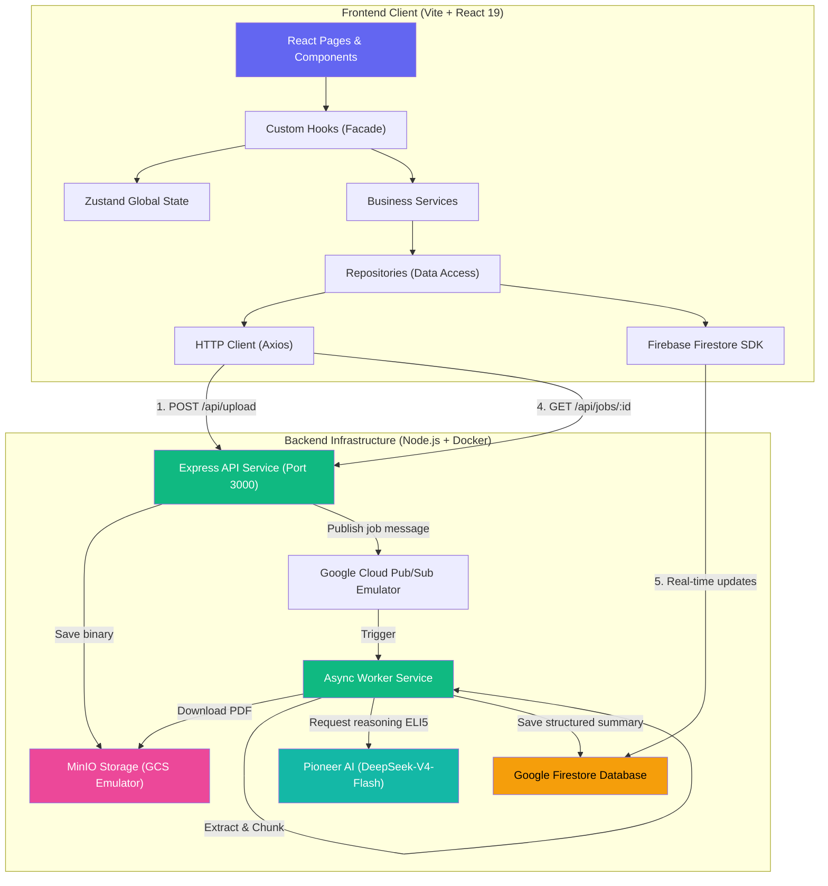

# ChainExplain — Cryptocurrency Whitepaper ELI5 Explainer

ChainExplain adalah aplikasi full-stack modern yang dirancang untuk mendemistifikasi konsep teknis dan jargon rumit dalam dokumen *whitepaper* mata uang kripto dan protokol Web3. Menggunakan kecerdasan buatan Pioneer AI (DeepSeek-V4-Flash) dan arsitektur *event-driven* asinkron, ChainExplain merangkum penjelasan rumit menjadi ringkasan ELI5 (Explain Like I'm 5) yang sederhana, ramah pemula, dan dwibahasa (Indonesian & English).

---

## 🎯 Fitur Utama

1. **Upload Dokumen PDF**: Mengunggah file *whitepaper* secara instan (maksimal 10MB).
2. **Pistol Pemrosesan Asinkron (Real-time Pipeline)**: Visualisasi langkah-langkah pemrosesan (Extracting -> Chunking -> Summarizing) secara real-time yang didukung sinkronisasi Firestore.
3. **Bilingual ELI5 Summaries (Indonesian & English)**: Hasil ringkasan instan dua bahasa dengan analogi sederhana yang mudah dimengerti anak kecil.
4. **Analisis Berbasis Bab (Chapter Chunks)**: Rincian penjelasan yang dibagi per bagian dokumen sehingga lebih ringkas dan terfokus.
5. **Dark & Light Mode Premium**: Tampilan visual kelas dunia dengan transisi warna *smooth* dan animasi *tactile feedback* menggunakan Framer Motion.
6. **Robust Mock Simulation & Polling Fallback**: Sistem *auto-heal* di mana *frontend* akan otomatis beralih ke simulasi visual atau polling HTTP jika koneksi database/backend offline saat development.

---

## 🏗️ Arsitektur Sistem

ChainExplain dibagi menjadi dua komponen utama: **Backend** (Express API + Worker Service) dan **Frontend** (Vite + React 19).



---

## 💻 Tech Stack Lengkap

### Backend (Node.js CJS)
- **Server Framework**: Express 5.x
- **Storage**: MinIO SDK (Local S3 / Google Cloud Storage emulator compatibility)
- **Database**: Google Firestore Admin SDK
- **Queue/Messaging**: Google Cloud Pub/Sub Client
- **Text Extraction**: `pdf-parse` v2 (class-based API)
- **AI Reasoning**: Pioneer AI API (`deepseek-ai/DeepSeek-V4-Flash` model)

### Frontend (React ESM)
- **Vite 8.x + React 19.x**
- **State Management**: Zustand 5.x
- **Styling**: Tailwind CSS + Shadcn UI primitive components
- **Animations**: Framer Motion 12.x (Spring physics: stiffness 100, damping 20)
- **Icons**: Lucide React
- **Network**: Axios HTTP Client + Firebase Web Client SDK
- **Testing**: Vitest + React Testing Library + JSDom (56 unit tests)

---

## 🔌 API Contract Reference

API Backend mengekspos 3 endpoint utama di port `3000`:

### 1. `POST /api/upload`
Mengunggah file *whitepaper* PDF dan mendaftarkan job pemrosesan.
- **Request**: `multipart/form-data`, key `file` (PDF file, <= 10MB)
- **Success Response (201 Created)**:
```json
{
  "success": true,
  "data": {
    "jobId": "8bcf15ef-7128-4ef1-be0b-bcfef252f901",
    "status": "PENDING",
    "fileName": "bitcoin.pdf"
  }
}
```

### 2. `GET /api/jobs/:jobId`
Mendapatkan status dan data ringkasan terkini dari suatu job (polling fallback).
- **Success Response (200 OK)**:
```json
{
  "success": true,
  "data": {
    "id": "8bcf15ef-7128-4ef1-be0b-bcfef252f901",
    "status": "COMPLETED",
    "progress": 100,
    "project_name": "Bitcoin",
    "fileName": "bitcoin.pdf",
    "createdAt": "2026-05-26T12:00:00.000Z",
    "summaryId": {
      "project_vision": "Sistem uang elektronik peer-to-peer tanpa perantara pihak ketiga.",
      "overall_summary": "Bitcoin adalah uang digital ajaib...",
      "chapters": [
        {
          "title": "Buku Catatan Bersama",
          "points": ["Transaksi dicatat oleh semua orang", "Mencegah kecurangan secara mutlak"]
        }
      ]
    },
    "summaryEn": { ... }
  }
}
```

### 3. `GET /api/health`
Mengecek status kesehatan server.
- **Success Response (200 OK)**:
```json
{
  "status": "ok"
}
```

---

## 🚀 Panduan Menjalankan Project

### Prerequisites
Pastikan mesin Anda sudah terinstall:
- **Node.js** >= 22
- **Docker & Docker Compose** (untuk backend ecosystem)

---

### 📥 1. Setup & Run Backend

Ecosystem backend berjalan secara kontainerisasi penuh (API + Worker + Firestore + Pub/Sub + MinIO) untuk memudahkan onboarding lokal.

1. Masuk ke direktori backend:
```bash
cd chainexplain-be
```
2. Buat file konfigurasi development `.env.dev`:
```bash
cp .env.example .env.dev
```
3. Set variabel `PIONEER_API_KEY` di `.env.dev` menggunakan API key Pioneer AI Anda.
4. Jalankan seluruh kontainer backend:
```bash
docker compose --env-file .env.dev up --build
```
Server Express akan aktif di `http://localhost:3000`, emulator Firestore UI di `http://localhost:4000`, dan MinIO UI di `http://localhost:9001`.

---

### 📤 2. Setup & Run Frontend

Aplikasi frontend React berjalan menggunakan server dev Vite lokal.

1. Masuk ke direktori frontend:
```bash
cd chainexplain-fe
```
2. Buat file `.env` lokal:
```bash
cp .env.example .env
```
*(Catatan: Default `.env` sudah dikonfigurasi menggunakan kunci mock `'mock-api-key-value-for-local-dev'` agar Anda dapat mendemonstrasikan aplikasi secara offline tanpa Firebase cloud!)*

3. Install dependencies:
```bash
npm install
```
4. Jalankan server pembangunan lokal:
```bash
npm run dev
```
Aplikasi frontend akan aktif di `http://localhost:5173`.

---

## 🧪 Panduan Pengujian & Verifikasi

### 1. Menjalankan Unit Tests (Vitest)
Kami telah menulis **56 unit tests** komprehensif di sisi frontend yang menjamin validasi data, normalisasi data (DTO), logic business service, mapping custom error, dan siklus custom hooks.

Untuk menjalankan test:
```bash
cd chainexplain-fe
npm run test:run
```

### 2. Pengujian Manual dengan Dev Logging
Seluruh alur bisnis ChainExplain dilengkapi dengan logging interaktif **khavas development** (`devLogger.js`).

1. Buka browser (Chrome/Edge/Firefox) di `http://localhost:5173`.
2. Buka DevTools (F12) -> Masuk ke tab **Console**.
3. Di kolom filter log, masukkan `[ChainExplain]` atau `Flow:`.
4. Unggah dokumen PDF (misalnya whitepaper Bitcoin).
5. Amati di console bagaimana data mengalir dari **Hook** -> **Service** -> **Repo** -> **HTTP Client / Firestore** -> **Zustand Store**, memberikan Anda transparansi penuh atas *lifecycle* aplikasi Anda.
