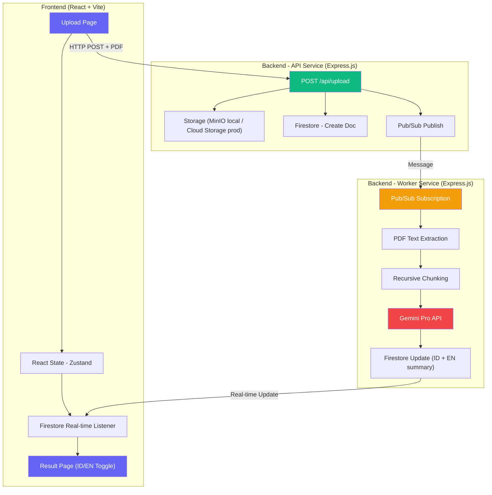
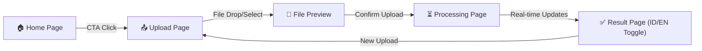

# ChainExplain — PRD/FRD Teknis

> **Versi**: 2.0 · **Tanggal**: 2026-05-16 · **Status**: Draft v2 — Menunggu Persetujuan Final

## 1. Ringkasan Produk

**ChainExplain** adalah web-app MVP yang menyederhanakan whitepaper Crypto/Web3 menjadi rangkuman bergaya "Explain Like I'm 5" (ELI5) menggunakan Google Gemini Pro API. Output summary tersedia dalam **2 bahasa** (Indonesia & English) dengan toggle di UI.

Sistem menggunakan arsitektur **event-driven & asynchronous** dengan pemisahan folder **Backend (BE)** dan **Frontend (FE)**.

- **Authentication**: Public access (tanpa login) untuk MVP
- **History**: Tidak ada riwayat upload (MVP)
- **Local Testing**: Firebase Local Emulator & MinIO untuk testing lokal

---

## 2. Arsitektur Sistem



### Kenapa Butuh Pub/Sub & Worker?

> [!IMPORTANT]
> Proses PDF + panggil Gemini bisa butuh **1-3 menit**. Tanpa worker, API tersumbat dan user menunggu timeout.

| Tanpa Pub/Sub | Dengan Pub/Sub + Worker |
|---|---|
| API langsung proses → HTTP timeout 30s | API return "ok" dalam <1 detik |
| Server tersumbat, user lain tidak bisa upload | Worker proses di background |
| Kalau crash, data hilang | Pub/Sub auto-retry kalau worker crash |
| Tidak bisa scale | Tambah worker untuk handle lebih banyak |

### Alur Data

| # | Step | Service | Action |
|---|------|---------|--------|
| 1 | User upload PDF | Frontend | `POST /api/upload` with `multipart/form-data` |
| 2 | Simpan PDF | API Service | Upload ke Storage (MinIO lokal / Cloud Storage prod) |
| 3 | Buat dokumen | API Service | Create Firestore doc (`status: PENDING`) |
| 4 | Publish message | API Service | Publish `jobId` ke Pub/Sub topic |
| 5 | Return response | API Service | `{ jobId, status: PENDING }` |
| 6 | Listen real-time | Frontend | Firestore `onSnapshot` listener |
| 7 | Worker triggered | Worker | Pub/Sub push/pull subscription |
| 8 | Extract PDF text | Worker | `pdf-parse` library |
| 9 | Chunk text | Worker | Recursive chunking (max 8000 chars/chunk) |
| 10 | Call Gemini | Worker | ELI5 prompt per chunk → bilingual output (ID + EN) |
| 11 | Update Firestore | Worker | `status: COMPLETED`, simpan `summaryId` + `summaryEn` |
| 12 | UI update | Frontend | Real-time listener → render result (toggle ID/EN) |

---

## 3. Struktur Folder Project

```
e:/Programming/JuaraVibeCoding/
├── chainexplain-be/                # Backend monorepo
│   ├── src/
│   │   ├── api/                    # API Service (Express)
│   │   │   ├── routes/
│   │   │   │   └── upload.routes.js
│   │   │   ├── controllers/
│   │   │   │   └── upload.controller.js
│   │   │   ├── middleware/
│   │   │   │   ├── multer.js
│   │   │   │   ├── errorHandler.js
│   │   │   │   └── rateLimiter.js
│   │   │   └── validators/
│   │   │       └── upload.validator.js
│   │   ├── worker/                 # Worker Service
│   │   │   ├── subscriber.js       # Pub/Sub listener
│   │   │   ├── processors/
│   │   │   │   ├── pdfExtractor.js
│   │   │   │   ├── textChunker.js
│   │   │   │   └── geminiSummarizer.js
│   │   │   └── index.js
│   │   ├── shared/                 # Shared utilities
│   │   │   ├── config/
│   │   │   │   ├── firebase.js
│   │   │   │   ├── storage.js      # Abstraksi: MinIO (local) / Cloud Storage (prod)
│   │   │   │   └── pubsub.js
│   │   │   ├── models/
│   │   │   │   └── job.model.js
│   │   │   └── utils/
│   │   │       ├── logger.js
│   │   │       └── errors.js
│   │   └── index.js                # API entry point
│   ├── .env.example
│   ├── docker-compose.yml          # MinIO + services for local dev
│   ├── Dockerfile.api
│   ├── Dockerfile.worker
│   └── package.json
│
├── chainexplain-fe/                # Frontend (React + Vite)
│   ├── src/
│   │   ├── components/
│   │   │   ├── layout/
│   │   │   │   ├── Header.jsx
│   │   │   │   ├── Footer.jsx
│   │   │   │   └── Layout.jsx
│   │   │   ├── upload/
│   │   │   │   ├── DropZone.jsx
│   │   │   │   ├── FilePreview.jsx
│   │   │   │   └── UploadProgress.jsx
│   │   │   ├── result/
│   │   │   │   ├── SummaryCard.jsx
│   │   │   │   ├── LanguageToggle.jsx  # Toggle ID/EN
│   │   │   │   ├── ChunkAccordion.jsx
│   │   │   │   └── CopyButton.jsx
│   │   │   ├── processing/
│   │   │   │   ├── ProcessingStatus.jsx
│   │   │   │   └── StepIndicator.jsx
│   │   │   └── ui/
│   │   │       ├── Button.jsx
│   │   │       ├── Card.jsx
│   │   │       ├── Skeleton.jsx        # Loading skeleton
│   │   │       ├── LoadingSpinner.jsx
│   │   │       └── AnimatedBackground.jsx
│   │   ├── pages/
│   │   │   ├── HomePage.jsx
│   │   │   ├── UploadPage.jsx
│   │   │   ├── ProcessingPage.jsx
│   │   │   └── ResultPage.jsx
│   │   ├── store/
│   │   │   └── useJobStore.js      # Zustand store
│   │   ├── hooks/
│   │   │   ├── useFirestoreListener.js
│   │   │   └── useUpload.js
│   │   ├── services/
│   │   │   ├── api.js
│   │   │   └── firebase.js
│   │   ├── lib/
│   │   │   └── motion.js
│   │   ├── styles/
│   │   │   └── index.css
│   │   ├── App.jsx
│   │   └── main.jsx
│   ├── tailwind.config.js
│   ├── vite.config.js
│   └── package.json
│
├── .agents/
│   ├── skills/
│   └── workflow/
│       └── agent-workflow.md
│
└── logs/
    └── CHANGELOG.md
```

---

## 4. Firestore Data Model

### Collection: `jobs`

```javascript
{
  id: "uuid-v4",
  fileName: "bitcoin_whitepaper.pdf",
  fileUrl: "gs://bucket/uploads/uuid/file.pdf",  // atau MinIO URL untuk local
  fileSize: 184320,
  status: "PENDING",       // PENDING | PROCESSING | EXTRACTING | CHUNKING | SUMMARIZING | COMPLETED | FAILED
  progress: 0,             // 0-100
  totalChunks: 0,
  processedChunks: 0,
  summaryId: null,         // Final ELI5 summary — Bahasa Indonesia
  summaryEn: null,         // Final ELI5 summary — English
  chunks: [],              // Array of { index, summaryId, summaryEn }
  error: null,
  metadata: {
    pageCount: 0,
    extractedTextLength: 0,
    modelUsed: "gemini-pro",
    tokenUsage: { input: 0, output: 0 }
  },
  createdAt: Timestamp,
  updatedAt: Timestamp,
  completedAt: null
}
```

### Firestore Security Rules (MVP)

```javascript
rules_version = '2';
service cloud.firestore {
  match /databases/{database}/documents {
    match /jobs/{jobId} {
      allow read: if true;      // MVP: public read
      allow write: if false;    // Only server-side writes
    }
  }
}
```

---

## 5. API Contract

### `POST /api/upload`

**Request**: `multipart/form-data`
| Field | Type | Required | Constraint |
|-------|------|----------|------------|
| `file` | File (PDF) | Yes | Max 10MB, `.pdf` only |

**Response** `201 Created`:
```json
{
  "success": true,
  "data": {
    "jobId": "abc-123-def",
    "status": "PENDING",
    "fileName": "whitepaper.pdf"
  }
}
```

**Error Responses**:
| Code | Scenario |
|------|----------|
| `400` | No file / invalid format / exceeds size |
| `429` | Rate limit exceeded |
| `500` | Internal server error |

### `GET /api/jobs/:jobId`

**Response** `200 OK`:
```json
{
  "success": true,
  "data": {
    "id": "abc-123-def",
    "status": "COMPLETED",
    "progress": 100,
    "summaryId": "Bitcoin itu kayak uang digital...",
    "summaryEn": "Bitcoin is like digital money...",
    "fileName": "whitepaper.pdf",
    "createdAt": "2026-05-16T12:00:00Z"
  }
}
```

### `GET /api/health`

Health check endpoint.

---

## 6. AI Pipeline — Gemini Pro Integration

### Prompt Template (Bilingual ELI5)

```
You are an expert at simplifying complex concepts for a 5-year-old audience.

Task: Explain the following crypto/web3 whitepaper section using "Explain Like I'm 5" (ELI5) style.

Rules:
- Use simple analogies a 5-year-old can understand
- Avoid technical jargon, replace with simple words
- Maximum 3 paragraphs per section
- Make it engaging and fun

IMPORTANT: You MUST provide TWO separate summaries:
1. "summary_id": The ELI5 explanation in Bahasa Indonesia
2. "summary_en": The ELI5 explanation in English

Respond ONLY in valid JSON format:
{
  "summary_id": "...",
  "summary_en": "..."
}

Whitepaper section:
---
{chunk_text}
---
```

### Chunking Strategy

**Kenapa 8000 karakter?** ≈ 2000 tokens, menyisakan ruang cukup untuk prompt instruksi + bilingual response.

**Apa itu overlap?** 500 karakter terakhir dari Chunk N diulang di awal Chunk N+1 agar konteks tidak terputus di tengah kalimat.

**Semantic boundaries?** Prioritas potong: paragraf → kalimat → kata. Tidak pernah potong di tengah kata.

```
Input PDF Text
    ↓
Recursive Text Splitter
    ├── Max chunk size: 8000 characters
    ├── Overlap: 500 characters
    ├── Split by: paragraph → sentence → word
    └── Preserve semantic boundaries
    ↓
Array of Chunks
    ↓
Sequential Gemini API calls (with rate limiting)
    ↓
Merge bilingual summaries into final ELI5 document (ID + EN)
```

---

## 7. Frontend — UI/UX Design Spec

### Design System & Theme Mode Support

The application features a fully cohesive, spring-animated Dual-Theme System (Light Mode & Dark Mode).

| Token | Dark Mode Value | Light Mode Value | Description |
|-------|-----------------|------------------|-------------|
| **Primary** | `#6366f1` (Indigo 500) | `#4f46e5` (Indigo 600) | Main CTA & highlighted features |
| **Secondary** | `#8b5cf6` (Violet 500) | `#7c3aed` (Violet 600) | Secondary accents & gradient styling |
| **Accent** | `#06b6d4` (Cyan 500) | `#0891b2` (Cyan 600) | Success status badges & micro-actions |
| **Background** | `#0f172a` (Slate 900) | `#f8fafc` (Slate 50) | Main backdrop layout background |
| **Surface/Card** | `#1e293b` (Slate 800) | `#ffffff` (White) | Cards & dynamic forms container |
| **Text Primary** | `#f8fafc` (Slate 50) | `#0f172a` (Slate 900) | Crisp high-contrast primary text |
| **Text Secondary** | `#94a3b8` (Slate 400) | `#475569` (Slate 600) | Soft muted description labels |
| **Border** | `#334155` (Slate 700) | `#e2e8f0` (Slate 200) | Thin structural division line |
| **Font Family** | `'Inter', sans-serif` | `'Inter', sans-serif` | Modern clean typography standard |
| **Border Radius** | `12px` (cards), `8px` (buttons) | `12px` (cards), `8px` (buttons) | Layout corner rounding token |

### Framer Motion — Animation Specs

| Component | Animation | Duration |
|-----------|-----------|----------|
| Page transitions | Fade + slide up | 0.4s ease-out |
| DropZone hover | Scale 1.02 + glow border | 0.2s |
| Upload progress | Spring-based progress bar | stiffness: 100 |
| Processing steps | Staggered fade-in (0.1s delay each) | 0.3s |
| Summary cards | Slide up + fade | 0.5s spring |
| Language toggle | Smooth content swap | 0.3s |
| Copy button | Scale bounce on click | 0.15s |
| Background | Animated gradient blobs | 8s infinite loop |

### User Flow



---

## 8. State Management (Zustand)

```javascript
const useJobStore = create((set) => ({
  // State
  currentJobId: null,
  jobStatus: 'IDLE',      // IDLE | UPLOADING | PENDING | PROCESSING | COMPLETED | FAILED
  progress: 0,
  summaryId: null,         // Indonesian summary
  summaryEn: null,         // English summary
  activeLang: 'id',        // 'id' | 'en' — toggle di UI
  error: null,
  uploadedFile: null,

  // Actions
  setUploadedFile: (file) => set({ uploadedFile: file }),
  startUpload: () => set({ jobStatus: 'UPLOADING', error: null }),
  setJobId: (id) => set({ currentJobId: id, jobStatus: 'PENDING' }),
  toggleLang: () => set((s) => ({ activeLang: s.activeLang === 'id' ? 'en' : 'id' })),
  updateFromFirestore: (data) => set({
    jobStatus: data.status,
    progress: data.progress,
    summaryId: data.summaryId,
    summaryEn: data.summaryEn,
    error: data.error
  }),
  reset: () => set({
    currentJobId: null, jobStatus: 'IDLE', progress: 0,
    summaryId: null, summaryEn: null, activeLang: 'id',
    error: null, uploadedFile: null
  }),
}))
```

---

## 9. Implementation Tracker — Checklist Eksekusi

> [!IMPORTANT]
> Setiap task yang dikerjakan akan dicatat dan dicentang di file **TASK.md** terpisah.
> Agent akan otomatis update progress dan lanjut ke task berikutnya.

### Fase 0: Project Setup & Configuration
- [ ] Inisialisasi `chainexplain-be/` — `npm init`, install dependencies
- [ ] Inisialisasi `chainexplain-fe/` — Vite + React (`npx create-vite`)
- [ ] Install FE dependencies (zustand, framer-motion, firebase, axios, react-router-dom, react-dropzone)
- [ ] Setup Tailwind CSS di FE
- [ ] Buat `.env.example` untuk BE & FE
- [ ] Setup `docker-compose.yml` untuk MinIO (local storage testing)
- [ ] Jalankan `docker-compose up -d` untuk setup & start MinIO di docker local

### Fase 1: Database & Cloud Infrastructure
- [ ] 📖 **Provide manual guide**: Setup Firebase project baru di console (step-by-step)
- [ ] 📖 **Provide manual guide**: Enable Firestore di Firebase Console
- [ ] 📖 **Provide manual guide**: Setup Cloud Storage bucket di GCP Console
- [ ] 📖 **Provide manual guide**: Setup Pub/Sub topic & subscription di GCP Console
- [ ] 📖 **Provide manual guide**: Download service account key JSON
- [ ] Buat shared config files (`firebase.js`, `storage.js`, `pubsub.js`)
- [ ] Buat `job.model.js` — helper functions CRUD Firestore
- [ ] Buat `logger.js` — structured logging utility

### Fase 2: Backend API Service
- [ ] Setup Express server (`index.js`) + middleware (CORS, helmet, morgan, rate limiter)
- [ ] Buat `multer.js` middleware (PDF only, max 10MB)
- [ ] Buat `upload.validator.js` — validasi file input
- [ ] Buat `upload.controller.js` — orchestrate upload flow
- [ ] Buat `upload.routes.js` — `POST /api/upload`, `GET /api/jobs/:id`, `GET /api/health`
- [ ] Buat `errorHandler.js` — centralized error handling
- [ ] Buat `Dockerfile.api`

### Fase 3: Backend Worker Service
- [ ] Buat `subscriber.js` — Pub/Sub message handler
- [ ] Buat `pdfExtractor.js` — extract text dari PDF (Storage)
- [ ] Buat `textChunker.js` — recursive chunking with overlap
- [ ] Buat `geminiSummarizer.js` — Gemini Pro API + bilingual ELI5 prompt
- [ ] Buat `worker/index.js` — worker entry point
- [ ] Implement progress tracking — update Firestore per chunk
- [ ] Implement error handling & retry logic (max 3 retries)
- [ ] Buat `Dockerfile.worker`

### Fase 4: Frontend — React UI & Animations Implementation
- [ ] **Design System Setup**: Tailwind config, import Inter font
- [ ] **Layout Components**: `Header.jsx`, `Footer.jsx`, `Layout.jsx` — glassmorphism navbar
- [ ] **Animated Background**: `AnimatedBackground.jsx` — gradient blob animation
- [ ] **UI Primitives**: `Button.jsx`, `Card.jsx`, `Skeleton.jsx`, `LoadingSpinner.jsx`
- [ ] **Home Page**: `HomePage.jsx` — hero section, CTA, feature highlights
- [ ] **Upload Components**: `DropZone.jsx`, `FilePreview.jsx`, `UploadProgress.jsx`
- [ ] **Upload Page**: `UploadPage.jsx` — combine upload components
- [ ] **Processing Components**: `ProcessingStatus.jsx`, `StepIndicator.jsx`
- [ ] **Processing Page**: `ProcessingPage.jsx` — real-time progress with spring animations
- [ ] **Result Components**: `SummaryCard.jsx`, `LanguageToggle.jsx`, `ChunkAccordion.jsx`, `CopyButton.jsx`
- [ ] **Result Page**: `ResultPage.jsx` — bilingual summary display with toggle
- [ ] **Page Transitions**: Setup `AnimatePresence`
- [ ] **Responsive Design**: Mobile-first

### Fase 5: State Management & Integration
- [ ] Setup `useJobStore.js` — Zustand store (state + actions + language toggle)
- [ ] Buat `firebase.js` — Firebase client SDK init
- [ ] Buat `useFirestoreListener.js` — custom hook for `onSnapshot`
- [ ] Buat `useUpload.js` — custom hook for upload flow
- [ ] Buat `api.js` — Axios instance
- [ ] Setup React Router (`App.jsx`) — routes + AnimatePresence
- [ ] Integration testing: Upload → Processing → Result full flow
- [ ] Error state handling & retry UI

### Fase 6: Testing & Polish
- [ ] BE integration test (upload → Pub/Sub → worker → Firestore)
- [ ] Loading skeleton components implementation
- [ ] Buat manual test case document (lihat Section 11)

### Fase 7: Deployment — Google Cloud Run
- [ ] 📖 **Provide manual guide**: Build & push Docker images ke GCR/Artifact Registry
- [ ] 📖 **Provide manual guide**: Deploy API Service ke Cloud Run
- [ ] 📖 **Provide manual guide**: Deploy Worker Service ke Cloud Run
- [ ] 📖 **Provide manual guide**: Configure Pub/Sub push → Worker URL
- [ ] 📖 **Provide manual guide**: Setup env variables di Cloud Run
- [ ] 📖 **Provide manual guide**: Deploy Frontend (Firebase Hosting recommended)
- [ ] 📖 **Provide domain recommendation** (lihat Section 12)

---

## 10. Local Development Setup — Firebase Emulator & MinIO

Untuk testing lokal, Firestore akan disimulasikan menggunakan **Firebase Local Emulator**, sedangkan PDF disimpan di **MinIO** (S3-compatible).

### Firebase Emulator
Gunakan emulator untuk menjalankan Firestore lokal tanpa biaya GCP:
```bash
# Jika belum punya firebase-tools
npm install -g firebase-tools
firebase init emulators
firebase emulators:start
```
Pastikan `chainexplain-be/src/shared/config/firebase.js` sudah mendeteksi `process.env.FIRESTORE_EMULATOR_HOST` (biasanya otomatis jika emulator jalan).

### MinIO Setup

```yaml
# docker-compose.yml (di chainexplain-be/)
services:
  minio:
    image: minio/minio
    ports:
      - "9000:9000"
      - "9001:9001"     # MinIO Console UI
    environment:
      MINIO_ROOT_USER: minioadmin
      MINIO_ROOT_PASSWORD: minioadmin
    command: server /data --console-address ":9001"
    volumes:
      - minio_data:/data

volumes:
  minio_data:
```

Backend `storage.js` akan punya abstraction:
- `NODE_ENV=development` → pakai MinIO (`localhost:9000`)
- `NODE_ENV=production` → pakai Cloud Storage

---

## 11. Manual Test Cases

| # | Scenario | Steps | Expected Result |
|---|----------|-------|-----------------|
| 1 | Happy path — Upload PDF | Upload valid PDF < 10MB | Status: PENDING → PROCESSING → COMPLETED, summary muncul |
| 2 | Invalid file type | Upload file .docx/.png | Error 400: "Only PDF files are allowed" |
| 3 | File too large | Upload PDF > 10MB | Error 400: "File size exceeds 10MB limit" |
| 4 | No file selected | Submit tanpa file | Error 400: "No file uploaded" |
| 5 | Real-time progress | Upload PDF 10+ pages | Progress bar update real-time (0% → 100%) |
| 6 | Language toggle | Click toggle ID/EN di result page | Summary berubah antara Indonesia dan English |
| 7 | Copy summary | Click copy button | Text tersalin ke clipboard, toast notification |
| 8 | Network error | Matikan backend, coba upload | Error message muncul, tombol retry tersedia |
| 9 | Worker crash | Kill worker saat processing | Pub/Sub retry, status akhirnya COMPLETED |
| 10 | Multi-page PDF | Upload whitepaper 30+ halaman | Chunking bekerja, semua chunk ter-summarize |

---

## 12. Domain & Deployment Recommendations

> [!NOTE]
> Rekomendasi domain untuk deployment GCP:

| Option | Domain | Platform | Cost |
|--------|--------|----------|------|
| **A (Recommended)** | `chainexplain.web.app` | Firebase Hosting (FE) + Cloud Run (BE) | **Gratis** (subdomain Firebase) |
| B | `chainexplain.run.app` | Cloud Run (FE + BE) | **Gratis** (subdomain Cloud Run) |
| C | Custom domain (misal `chainexplain.id`) | Firebase Hosting + Cloud Run | ~$10-15/tahun (beli domain) |

**Rekomendasi**: Gunakan **Option A** untuk MVP — `chainexplain.web.app` untuk frontend (Firebase Hosting gratis, CDN global, auto SSL), dan Cloud Run untuk backend (`chainexplain-api-xxxxx.run.app`). Nanti kalau mau custom domain, tinggal mapping di Firebase Hosting console.

---

## 13. GCP Setup Guides (Manual)

> [!IMPORTANT]
> Panduan step-by-step untuk setup di platform web akan disediakan di **Fase 1**.
> Agent akan membuat dokumen guide terpisah saat memasuki fase tersebut.
> Kamu cukup ikuti langkahnya di browser, lalu lapor ke agent bahwa sudah selesai.

Yang akan di-guide secara manual:
1. Buat Firebase project baru
2. Enable Firestore (mode production)
3. Buat Cloud Storage bucket
4. Setup Pub/Sub topic & subscription
5. Buat & download service account key
6. Deploy ke Cloud Run (Fase 7)

---

## 14. Non-Functional Requirements

| Requirement | Target |
|-------------|--------|
| Max PDF size | 10 MB |
| Max processing time | < 3 minutes |
| API response time | < 500ms (upload initiation) |
| Concurrent uploads | 10 (MVP) |
| Rate limiting | 5 requests/minute per IP |

---

## Decisions Log (dari feedback user)

| # | Decision | Rationale |
|---|----------|-----------|
| 1 | Public access, no auth | MVP fokus simple flow |
| 2 | Bilingual output (ID + EN) | UI toggle, 1 API call → 2 summaries |
| 3 | No upload history | MVP scope |
| 4 | MinIO for local testing | Menghindari biaya Cloud Storage saat development |
| 5 | Manual GCP setup | User prefer setup via web console, bukan IaC |
| 6 | No smoke test, no cloud logging | Project simple, tidak perlu |
| 7 | Testing: integration BE + loading skeleton only | Simplified testing scope |
| 8 | Manual test cases provided | No automated tests, user manual test |
| 9 | Firebase Hosting for FE | Gratis, CDN, auto SSL |
